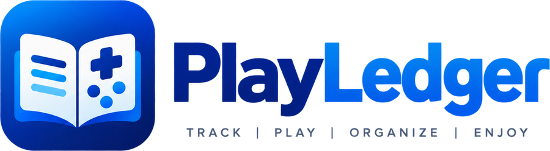
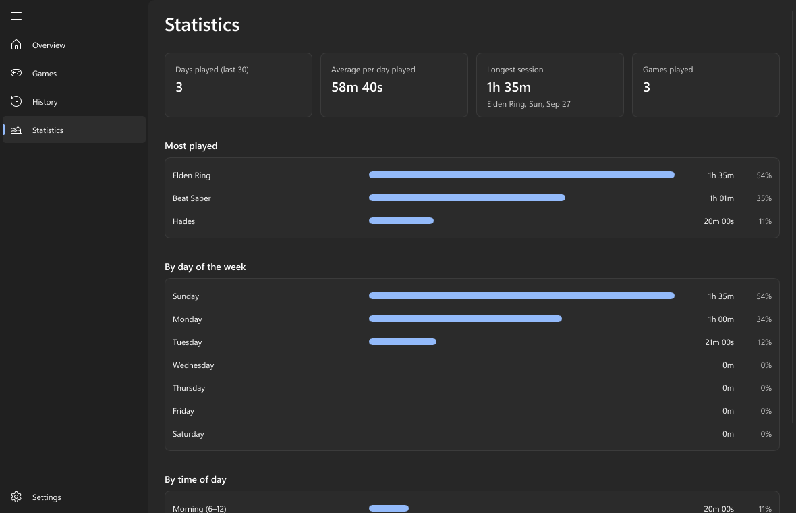
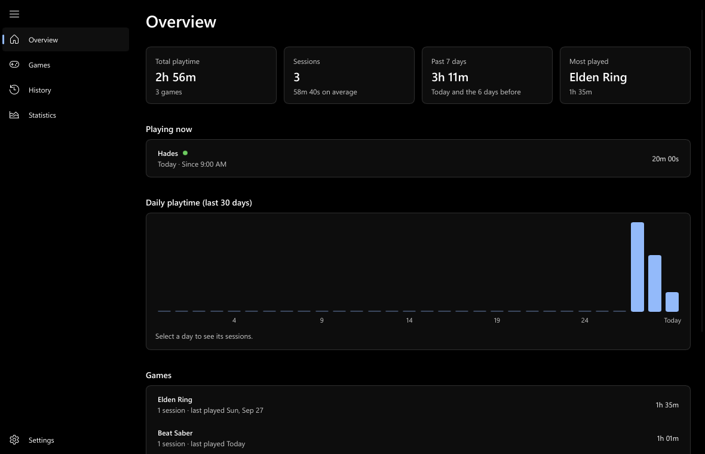

<p align="center"></p>

# PlayLedger

**Know exactly how much you play.** PlayLedger is a free, open-source Windows app that sits quietly in the
system tray, recognises your games the moment they start, and records every session: when you opened the game,
when you closed it, and how long you played. A Windows 11 dashboard turns that into totals, daily charts, a 30-day
history and statistics, with each game's box art on its own tile.

It works across every store and launcher at once (Steam, Epic Games, GOG, Ubisoft Connect, EA app, Xbox app,
Riot Games and more), needs no account, and keeps your history on your own PC.


> **PlayLedger was called Playtime Tracker** until version 3.1.0. Updating keeps everything: your history, settings
> and artwork stay where they were (so some folders are still named `Playtime Tracker`), and the Start menu shortcut
> and Apps entry are renamed for you.

## Highlights

- **Automatic**: no timers to start or stop. Open a game and it's tracked; close it and the session is logged.
- **Finds games on its own**: across every major launcher, Windows' own list of games, and popular games that install
  by themselves (Roblox, Minecraft, Genshin Impact and more). Anything else takes one click to add.
- **Accurate**: sleep never counts, a launcher handing off to its game stays one session, and play survives a crash or
  power cut.
- **A proper Windows 11 app**: your accent colour, light and dark themes with a true-black AMOLED mode, full keyboard and screen reader
  support, and a layout that fits any window size.
- **Your data stays yours**: nothing about your play leaves your PC. History is encrypted for your Windows account,
  and you can export every session to a spreadsheet at any time.
- **Light and native**: two small programs written in Rust. No runtime to install, no browser engine, no background
  services.
- **Keeps itself up to date**, safely and never in the middle of a game.

## Contents

- [Requirements](#requirements)
- [Install](#install)
- [Getting started](#getting-started)
- [The tray icon](#the-tray-icon)
- [The dashboard](#the-dashboard)
- [Game artwork](#game-artwork)
- [How games are found](#how-games-are-found)
- [How sessions are counted](#how-sessions-are-counted)
- [Settings](#settings)
- [Your data](#your-data)
- [Privacy: what goes online](#privacy-what-goes-online)
- [Updates](#updates)
- [Troubleshooting](#troubleshooting)
- [Uninstall](#uninstall)
- [Build it yourself](#build-it-yourself)
- [Support and licence](#support-and-licence)

## Requirements

- **Windows 11** on a 64-bit (x64) PC. Windows 10 isn't tested.
- A 7 MB download. No administrator rights, and nothing else to install.

## Install

1. Download **`Setup.exe`** from the [latest release](https://github.com/LunoviaVR/PlaytimeTracker/releases/latest).
2. Double-click it and click **Next → Next → Install → Finish**.

The installer:

- installs for your Windows account only, to `%LocalAppData%\Programs\Playtime Tracker`
- adds a Start menu shortcut, and a desktop shortcut if you tick the box
- sets PlayLedger to start when you sign in to Windows
- adds it to **Settings → Apps → Installed apps**, so it uninstalls like any other app
- starts the tracker when you click **Finish**

**Windows SmartScreen** may warn about an unrecognised app the first time, because the installer isn't code-signed.
Click **More info → Run anyway**.

**Upgrading** is the same: run the new `Setup.exe` over the old version, or let the app
[update itself](#updates). Your history and settings are always kept. Version 2.x upgrades to 3.0 in place, and before
3.0 first runs it backs up your history and settings to `Documents\Playtime Tracker\Backups`.

**Coming from Game Session Tracker?** It's the same app under its old name. The installer closes and removes the old
version (its shortcuts, startup entry and Apps entry), and on first start your history moves from
`Documents\Game Session Tracker` to `Documents\Playtime Tracker` with every session and setting intact.

## Getting started

After installing there's nothing to set up:

1. The controller icon appears in the system tray. Windows 11 may put new icons behind the **^** arrow next to the
   clock; to keep it in view, go to *Settings → Personalization → Taskbar → Other system tray icons* and turn on
   **PlayLedger**.
2. Open a game. Within a few seconds it's being tracked: hover over the tray icon to see *Playing: …*.
3. Close the game. A *Session logged* notification shows the game and how long you played.
4. Click the tray icon to open the dashboard and see it all.

If one of your games isn't picked up, add it in **Settings → Custom Games** (see [Troubleshooting](#troubleshooting)).

## The tray icon

The tracker is the part that runs all the time. It lives in the tray, looks for games every few seconds, and is
idle the rest of the time.

- **Hover** to see what's being tracked: *Playing: Hades (1h 02m)*, or *Not playing anything*.
- **Click** to open the dashboard.
- **Right-click** for a menu: what's playing, **Open dashboard**, **Settings**, **Install update x.y.z** (when one is
  ready) and **Exit**.

**Exit** stops tracking. A game that's running at that moment is logged up to that point. Closing the dashboard window
doesn't stop tracking.

## The dashboard

A Windows 11 window laid out like Task Manager: a navigation pane on the left (the **☰** button folds it to icons, and
it folds by itself in a narrow window) and five pages. Everything updates live: a game you're playing counts up every
second.

### Overview

Everything at a glance.

- **Four tiles**: total playtime (and how many games), number of sessions (and their average length), the past 7 days,
  and your most-played game.
- **Playing now**: games running right now, with how long each has been running.
- **Daily playtime**: a bar for each of the last 30 days. **Select a bar** to see that day's sessions.
- **Games**: every game with its total, number of sessions and when you last played it. Select a game to focus the whole
  page on it (tiles, chart and sessions); **All games** goes back.
- **Sessions**: every session, newest first, fifty at a time with **Show more**. Select one for its details.

In a light Windows theme, or with **Theme → Light**:


### Games

A tile for each game with its box art, or its icon while there isn't any. Search by name, and sort by most played,
recently played or name. What you're **playing now** comes first, with a *Playing* badge.

**Select a game** for its details: total playtime, number of sessions, average and longest session, first and last
played, and how it was found (Steam, Epic Games, your own folders and so on). From there you can **Show on Overview**,
**Stop tracking** or **Delete history**.

**Right-click a tile** (or press the Menu key or Shift+F10, or press and hold on a touch screen) for:

- **Change artwork ▸ Choose an image file…**, **Pick from SteamGridDB…** or **Use automatic artwork** (see
  [Game artwork](#game-artwork))
- **Stop tracking**: the game is added to Ignored Games; its history is kept.
- **Delete history…**: removes every session of the game, after asking.


### History

The last 30 days, one card per day: the total, which games you played and for how long, and a bar comparing the day
with your busiest one. Expand a day to list its sessions, and select a session for its details.


### Statistics

Where your time goes:

- **Four tiles**: how many of the last 30 days you played, the average playtime on those days, your longest session
  (which game and when), and how many games you've played.
- **Most played**: your games ranked by total time, with each one's share.
- **By day of the week**: which days you play most.
- **By time of day**: morning (6 am to noon), afternoon (noon to 6 pm), evening (6 pm to midnight) and night
  (midnight to 6 am).

Sessions are split hour by hour, so a session from 10 pm to 2 am counts partly as evening and partly as night, and
partly on each day.



### Session details

Select any session, finished or still running, to see:

- when the game was **opened** and **closed**, to the second, and how long it ran
- which session it was for that game (for example *#3 of 12*)
- the game's total and that day's total
- the program that was tracked, with **Show program** to open its folder

A running session keeps counting while the details are open. A finished session can be deleted from here; this is the
only way to remove a single session, since your history can't be edited by hand (see [Your data](#your-data)).


### Look and feel

- **Theme**: follows Windows' light or dark mode, or is always light or always dark.
- **Accent colour**: Windows' own, one of six presets (blue, violet, teal, green, amber, rose), or any colour you pick.
  Buttons, switches, selection and charts all use it.
- **AMOLED mode** (off by default): the dark theme uses true black for the window and pages, with cards just above
  it. It looks deeper, and on an OLED screen the black pixels are switched off, which saves power. It has no effect
  in the light theme.
- **Hardware acceleration** (on by default): the dashboard draws with your graphics card, with smooth text like the
  rest of Windows. If the window flickers or
  stays blank, for example over remote desktop, turn it off and click **Reopen now**. If the graphics card can't draw
  it at all, the dashboard switches to drawing without it by itself.
- **Any window size**: tiles reflow from four across to one per row, lists never squeeze text into a column of single
  letters, and the window keeps a sensible minimum size.
- **Accessible**: every control works with the keyboard (Tab, Space, Enter, and Escape to close a dialog) and has a
  label for screen readers.



## Game artwork

Box art comes from places already on your PC, with nothing downloaded:

- **Steam games**: Steam's own image cache.
- **Every game**: its program's icon, when there's no box art.

For more, turn on **Settings → Artwork → Download missing artwork** (off by default):

- **Steam games** get their pictures from the Steam store, looked up by the game's Steam ID only.
- **Everything else** needs your own free **SteamGridDB API key**. **Get API key** opens the page where you create one;
  paste it in and games from any launcher are matched by name. The key is stored in Windows Credential Manager on this
  PC, never in a file.

To choose a picture yourself, right-click a game on the **Games** page:

- **Choose an image file…**: any picture on your PC.
- **Pick from SteamGridDB…**: browse SteamGridDB's covers for the game and pick one (needs the key).
- **Use automatic artwork**: undo your choice.

Your choices are kept separately from the downloaded cache, so clearing the cache never loses them.

**Making your own cover**: tiles are 2:3, and **600 × 900** pixels works best (at least 320 × 480; at most 8192 pixels
a side and 16 MB). PNG (transparency is kept), JPEG and WebP are supported. At 600 × 900, corners are rounded by about
30 pixels, and while the game is running a *Playing* badge covers roughly the top-left 250 × 100, so keep anything
important out of those areas.

## How games are found

PlayLedger builds a list of your games from several sources, and looks again every 10 minutes and whenever you
change a detection setting (or click **Rescan installed games**). In order of priority:

1. **Your custom games**: programs you added in Settings, by file name or full path.
2. **Ignored programs** are never games, even if another source lists them.
3. **Store libraries**, read from each store's own records:
   - **Steam**: every library folder, with each game's name from its manifest
   - **Epic Games**: installed games, skipping engines and plug-ins
   - **GOG** and **Ubisoft Connect**: installed games from their registry entries
4. **Game folders**, where every sub-folder is a game: Steam's `steamapps\common`, EA app and Origin folders, the Xbox
   app's `XboxGames`, `Riot Games`, any drive's `X:\Games`, and folders you add yourself.
5. **Built-in games** that install outside any launcher: Roblox (including the Microsoft Store version), Minecraft
   (Java Edition and Bedrock), Genshin Impact, Honkai: Star Rail, Zenless Zone Zero, osu!, League of Legends, VALORANT
   and Fortnite. Only the game itself counts, not its launcher, crash reporter or Roblox Studio.
6. **Windows' list of games**: every program the Xbox Game Bar has recognised as a game, even after the game updates
   itself into a new version folder. (This can be turned off in **Settings → General**.)

Games in **Ignored Games** are never tracked. Launchers, installers, redistributables, crash reporters, anti-cheat,
SteamVR, Wallpaper Engine and the Unity and Unreal editors are ignored out of the box.

## How sessions are counted

- Every 5 seconds the tracker looks at the running programs and checks each new one against your games. Its full path
  is read even for games running as administrator.
- A **session starts** when a game appears and **ends** when it has been gone for 20 seconds; the end time is the
  last moment it was seen. A game that closes and reopens within that time, such as a launcher handing over to the
  game, stays one session.
- **Every session counts**, however short. You can set a minimum length in **Settings → Tracking** to skip very short
  ones.
- **Sleep and hibernation never count.** Going to sleep ends every session at the moment the PC went to sleep; a game
  still open when it wakes starts a new session.
- **Shutting down or exiting** logs running games up to that moment.
- **Crashes and power cuts**: running sessions are saved every minute, so after an unexpected restart they're recovered,
  ending the last time the game was seen. At most about a minute is lost.
- **Several games at once** are each tracked separately.

## Settings

Everything is on the dashboard's **Settings** page (or tray menu → **Settings**). Changes are saved and take effect
straight away.


| Section | Setting | Default |
| --- | --- | --- |
| **Appearance** | Theme: system, light or dark | System |
| | Accent colour: Windows', a preset, or any colour | Blue |
| | AMOLED mode (true black in the dark theme) | Off |
| | Hardware acceleration (applies when the dashboard reopens; **Reopen now** does it at once) | On |
| **Startup** | Start PlayLedger when you sign in to Windows | On |
| **General** | Show a notification when a session is logged | On |
| | Use Windows' list of games (Xbox Game Bar) | On |
| **Tracking** | How often to look for games | 5 seconds |
| | Shortest session worth keeping | Off (every session counts) |
| | How long a game can be closed before reopening it starts a new session | 20 seconds |
| **Artwork** | Download missing artwork | Off |
| | SteamGridDB API key, with **Get API key** and **Remove key** | None |
| **Custom Games** | **Add a game…**: pick any program's `.exe` and give it a name | None |
| **Game Folders** | **Add a folder…** where every sub-folder is a game, such as `D:\Games` | None |
| **Your Data** | **Rescan installed games**, **Export sessions…** (`.csv`), **Open report**, **Open data folder** | |
| **Ignored Games / Ignored Programs** | What never counts as playing, each with a search box and **Remove** | Launchers and tools |
| **Updates** | Check for updates | On |
| | Install updates automatically | On |
| | **Check now**, and **Install update** when one is ready | |
| **About** | The version you're running | |
| **Support PlayLedger** | **Tip** opens [cash.app/$LunoviaVR](https://cash.app/$LunoviaVR) in your browser | |

Settings are stored in the protected `settings.dat` (see [Your data](#your-data)), so they can only be changed here.

## Your data

Everything is kept in `Documents\Playtime Tracker\`. **Settings → Your Data → Open data folder** takes you there.

| File | What it is |
| --- | --- |
| `sessions.dat` | Your play history, protected (see below). |
| `settings.dat` | Your settings, protected. |
| `*.bak` | The previous saved copy of each protected file, used if a file is damaged or changed. |
| `Game Stats.txt` | A plain-text report: every game's times played, total, average and last played, then every session. Rewritten on every save. |
| `Sessions.csv` | Every session, one per row: game, start, end, length in minutes, length, and program. Opens in Excel or Google Sheets. Rewritten on every save. |
| `Backups\` | Copies of your history and settings, taken before a new version first runs. |
| `errors.log` | Only written if something goes wrong. |

`Game Stats.txt` and `Sessions.csv` are read-only; for a copy you can edit, use **Settings → Your Data → Export
sessions…**. Values that a spreadsheet could run as formulas are escaped, so exports are safe to open.

A shortened `Game Stats.txt`:

```
SUMMARY  (3 games, 4 sessions, 4h 37m total)
  Game                   Times played    Total time     Average  Last played
  ---------------------  ------------  ------------  ----------  ----------------------
  Beat Saber                        2        2h 01m      1h 00m  Tue Sep 29, 2026  12:01 AM
  Elden Ring                        1        1h 35m      1h 35m  Sun Sep 27, 2026  9:35 PM

SESSIONS BY GAME  (newest first)

Beat Saber
  Played 2 times, 2h 01m total
  #2    Mon Sep 28, 2026  11:00 PM  ->  Tue Sep 29, 2026  12:01 AM   1h 01m
  #1    Mon Sep 28, 2026  8:00 PM  ->  9:00 PM   1h 00m
```

### Protected history

Your history and settings **can't be edited by hand**, so your playtime stays honest:

- `sessions.dat` and `settings.dat` are encrypted and integrity-checked with Windows' built-in data protection (DPAPI)
  for your Windows account.
- Every save is numbered, and the number is also kept, protected, in your Windows profile. If an older copy of the
  history is put back to undo playtime, the app notices and uses the newest genuine copy.
- While the tracker runs, other programs can read the data files but can't change, replace or delete them.
- If a protected file is changed anyway, the app keeps the changed file aside as `….unverified-<date>`, goes back to
  the last saved copy, and tells you.

The protection is tied to your Windows account on this PC. Copying the folder to another PC or account doesn't carry
the history across: it's set aside there and a new history begins. To keep your own copy of every session, use
**Export sessions…**.

Other files: downloaded artwork is a cache in `%LocalAppData%\Playtime Tracker\Cache` (safe to delete), your own
artwork choices are next to it, and if the dashboard ever fails to start it leaves a note in
`%LocalAppData%\Playtime Tracker\dashboard-errors.log`.

## Privacy: what goes online

Nothing about your play history ever leaves your PC. There's no account, no analytics and no server. The only network
requests are:

- **Update checks** (unless you turn them off): a request to GitHub for this project's latest release, and downloading
  the installer when there's a new one.
- **Artwork** (only with **Download missing artwork** on): Steam store pictures looked up by Steam ID and, with your key,
  SteamGridDB searches by game name. Only an allow-list of image hosts is contacted, over HTTPS.
- **Links you click** (Get API key, Tip) open in your browser.

The tracker and the dashboard talk to each other over a private channel on your PC that only your Windows account can
open.

## Updates

PlayLedger checks this project's [GitHub releases](https://github.com/LunoviaVR/PlaytimeTracker/releases) a
minute after it starts and every 6 hours after that.

- **Automatic** (the default): when a new version is out and **no game is running**, it downloads and installs it,
  restarts, and shows *PlayLedger updated*. It never updates in the middle of a session.
- **By hand**: turn off **Install updates automatically** and you'll get a notification and an **Install update x.y.z**
  item in the tray menu instead. Install from there or from **Settings → Updates**, where a progress bar shows the
  download.
- **Checked before it runs**: the installer must come from this project's GitHub release over HTTPS and match the size
  and SHA-256 checksum GitHub recorded when it was uploaded. If anything doesn't match, nothing is installed.
- **Portable copies** (not installed with `Setup.exe`) are never replaced; they get a link to the download page.
- Turn off **Check for updates** to stop the checks entirely.

## Troubleshooting

**A game isn't being tracked.**
Add it in **Settings → Custom Games → Add a game…** by picking its `.exe`. If you keep games in a folder of your own, add that folder
in **Game Folders** so every game in it is found. Also check that it isn't in **Ignored Games** or **Ignored Programs**
(each list has a search box).

**A launcher or tool is being counted as a game.**
Right-click it on the **Games** page and choose **Stop tracking**, or add its program in **Ignored Programs**. Delete
the sessions it already logged with **Delete history…**.

**The dashboard flickers or stays blank.**
Turn off **Settings → Appearance → Hardware acceleration** and click **Reopen now**. This mostly helps over remote
desktop and with older graphics drivers.

**I can't see the tray icon.**
It's probably behind the **^** arrow next to the clock. See [Getting started](#getting-started) to keep it in view.

**The app said my history was "set aside".**
A data file was changed outside the app or copied from another PC or account. The app went back to the last genuine
copy, and the other file is kept next to it in `Documents\Playtime Tracker` in case you need it.

**Something else went wrong.**
Look in `Documents\Playtime Tracker\errors.log`, and
[open an issue](https://github.com/LunoviaVR/PlaytimeTracker/issues) with what happened.

## Uninstall

*Settings → Apps → Installed apps → PlayLedger → Uninstall.* The tracker is closed (a game in progress is logged
first) and removed, with its shortcuts and startup entry. Your history in `Documents\Playtime Tracker\` is kept, unless
you tick **Delete my play history and settings** in the uninstaller, which also removes the saved SteamGridDB key.

## Build it yourself

PlayLedger is written in [Rust](https://www.rust-lang.org), with the dashboard built on [Slint](https://slint.dev)
in its Fluent style. It's two programs:

- **`playtime-tracker.exe`**: the tray app that detects games, records sessions and keeps the data.
- **`PlaytimeTracker.Dashboard.exe`**: the window. It only shows data and sends your changes to the tracker, so
  closing it never affects tracking.

To build, install [Rust](https://rustup.rs) (`rust-toolchain.toml` picks the exact version) and
[NSIS](https://nsis.sourceforge.io) (`winget install NSIS.NSIS`), then run this in PowerShell from the repository
folder:

```powershell
./build.ps1
```

The installer is written to `publish\PlayLedgerSetup.exe`. `cargo test --workspace` runs the tests, and
[`docs/architecture/`](docs/architecture/) explains how the parts fit together. The dashboard can also draw any page to
an image without a screen, which is how the screenshots here are made:

```powershell
cargo run -p playtime-dashboard -- --render overview 1180x760 overview.png crates/playtime-dashboard/fixtures/responses.jsonl --dark
```

## Support and licence

- **Found a bug or have an idea?** [Open an issue](https://github.com/LunoviaVR/PlaytimeTracker/issues).
- **Security problem?** Report it privately as described in [SECURITY.md](SECURITY.md).
- **Enjoying it?** **Settings → Support PlayLedger → Tip**, or
  [cash.app/$LunoviaVR](https://cash.app/$LunoviaVR).

PlayLedger is free software under the GPL-3.0 (see [LICENSE](LICENSE)). The dashboard uses Slint under the
GPL-3.0.
