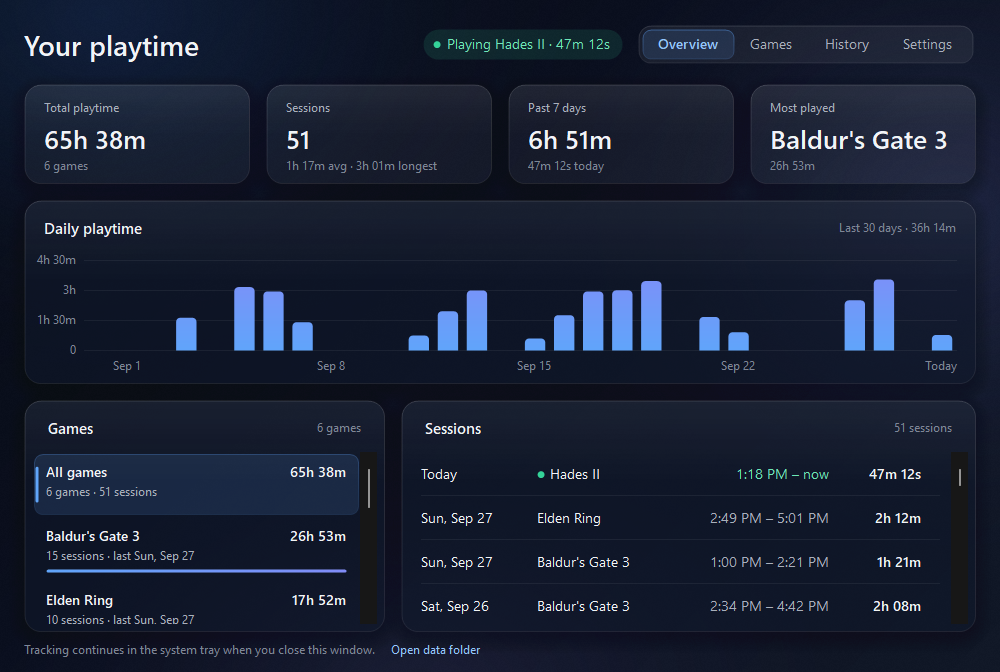
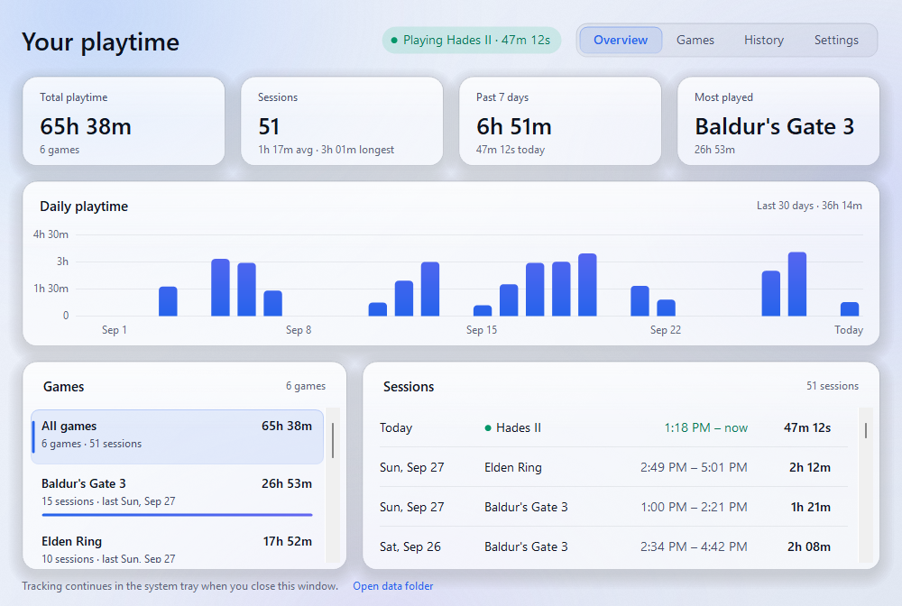
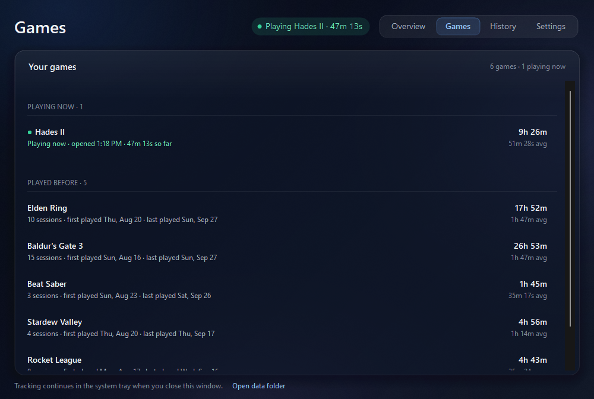
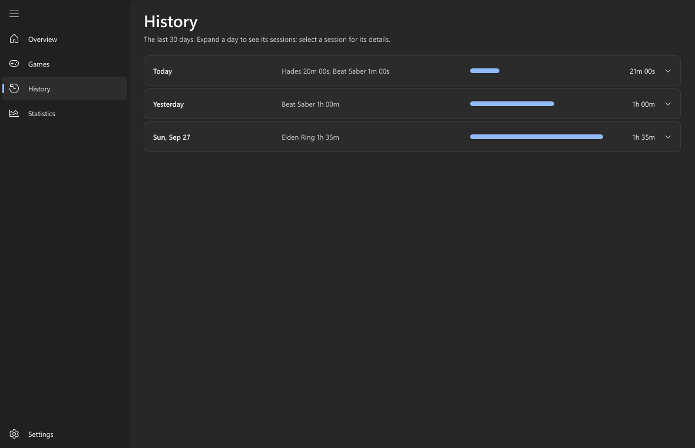
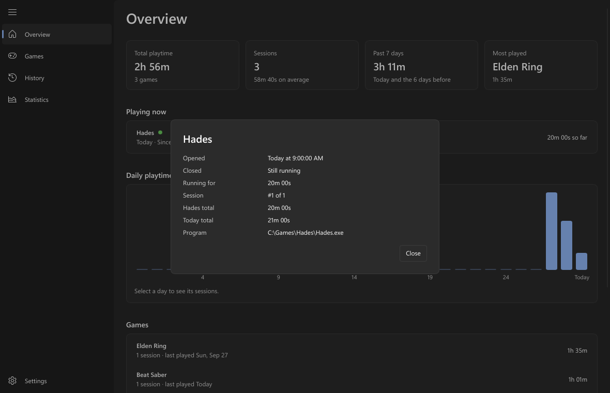
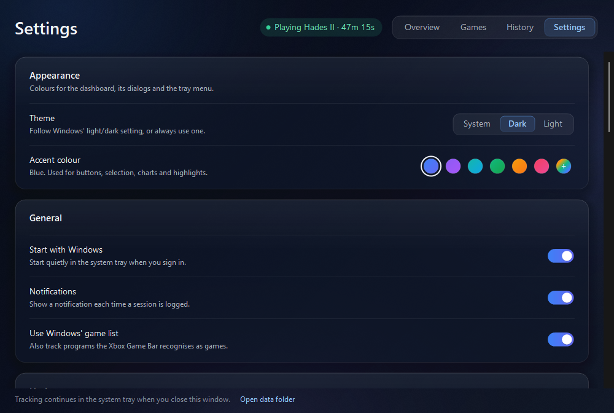

# Playtime Tracker

A small Windows 11 app that runs in the system tray, notices when you open a game, and keeps track of
how many times you've played each game and how long every session lasted.



- **Dashboard**: all your data in one window. Left-click the tray icon (or open *Playtime Tracker* from the Start menu).
- **Runs in the background** in the system tray (the controller icon). Right-click it for **Open dashboard**, **Settings** and **Exit**.
- **Starts with Windows** automatically. You can turn this off in **Settings**.
- **Close it any time** with **Exit** in the tray menu. A game that's running when you exit is logged up to that moment.
- **Finds games on its own** from Steam, Epic Games, GOG, Ubisoft Connect, EA app/Origin, Xbox app/Game Pass (`XboxGames`),
  Riot Games, any `X:\Games` folder, and every program Windows' Xbox Game Bar recognises as a game (even after the game
  updates itself into a new folder). It also knows popular games that install on their own: Roblox, Minecraft (Java and
  Bedrock), Genshin Impact, Honkai: Star Rail, Zenless Zone Zero, osu!, League of Legends, VALORANT and Fortnite.
  You can add anything else yourself (see [Settings](#settings)).
- **Updates itself** from this repository's GitHub releases (see [Updates](#updates)).

## The dashboard

The window has four pages, switched at the top right (or with Tab then ←/→):

- **Overview**
  - **Top row**: total playtime, number of sessions (and the average length), the past 7 days, and your most-played game.
  - **Daily playtime**: a bar per day for the last 30 days. Hover a bar to see the exact time; **click a bar** to see that day's sessions.
  - **Games**: every game with its total time, session count and when you last played it. Click a game to filter the whole
    page (tiles, chart and sessions) to that game; click **All games** to go back.
  - **Sessions**: every session, newest first, with date, start and end time, and length. A game you're playing right now
    shows at the top and counts up live. **Click a session** (or select it and press Enter) for its details.
- **Games**: what you're **playing now** (with when you opened it and how long it's been running) and every game you've
  **played before**, most recent first, with total and average time, session count, and first and last played.
  Click a game to open it on the Overview.
- **History**: the **last 30 days**, one row per day: total playtime, which games you played and for how long, and a bar
  compared with your busiest day. Click a day to list its sessions, then click a session for its details.
- **Settings**: see [Settings](#settings).

In a light Windows theme (or with **Theme → Light**) it looks like this:



| Games | History |
| --- | --- |
|  |  |



**Session details** (click any session, finished or still running) show when the game was **opened** and **closed**
(to the second), how long it ran, the program that was tracked (with **Show program** to open its folder), which session
it was for that game (e.g. *#3 of 12*), the game's total, and that day's total. A running session keeps updating while
the window is open. Finished sessions can be deleted from here too.

**Right-click a game** to stop tracking it (or track it again), or to delete its history.
**Right-click a session** for its details or to delete it.

When a game is selected, the tiles also show its average and longest session, and when you first played it.

Closing the window doesn't stop tracking; the app keeps running in the tray.

## Install

1. Download one of the installers:
   - **`PlaytimeTrackerSetup.exe`** (about 48 MB) has everything built in and works offline.
   - **`PlaytimeTrackerSetup-Online.exe`** (under 1 MB) is the same app. If your PC doesn't already have
     Microsoft's .NET 8 Desktop Runtime, setup downloads and installs it for you (Windows will ask for permission once).

   Both are built automatically by the **Build** workflow on GitHub (Actions tab → latest run → *Artifacts*),
   and attached to any release.
2. Double-click it and click through **Next → Next → Install → Finish**. No admin rights, no command prompt.

The installer:
- installs to `%LocalAppData%\Programs\Playtime Tracker`
- adds a Start menu shortcut (and a desktop shortcut if you tick the box)
- sets it to start with Windows
- adds it to **Settings → Apps → Installed apps** so you can uninstall it like any other app
- starts the tracker when you click **Finish**

Running the installer again upgrades in place and keeps your history.

**Coming from Game Session Tracker?** This is the same app under a new name. The installer closes and removes the old
version (its shortcuts, startup entry and Apps list entry), and on first start the app moves your history from
`Documents\Game Session Tracker` to `Documents\Playtime Tracker`. Your settings and sessions carry over unchanged.

Windows 11 hides new tray icons behind the **^** arrow next to the clock. To keep it visible: *Settings → Personalization → Taskbar → Other system tray icons* → turn on **Playtime Tracker**.

The first time you run the installer, Windows SmartScreen may warn about an unrecognised app because it isn't code-signed.
Click **More info → Run anyway**.

## Your files

Everything lives in `Documents\Playtime Tracker\` (dashboard → **Settings** → **Your data** → **Open folder**):

| File | What it is |
| --- | --- |
| `Game Stats.txt` | A plain-text version of the dashboard: times played, total and average time per game, and every session with start/end time and length. Read-only; regenerated on every save. |
| `Sessions.csv` | Every session, one per row. Opens in Excel / Google Sheets. Read-only; regenerated on every save (use **Export sessions** for a copy you can edit). |
| `sessions.dat` | Your play history, protected (see below). |
| `settings.dat` | Your settings, protected (see below). |
| `*.bak` | The previous saved copy of each protected file, used to recover if a file is damaged or changed. |
| `errors.log` | Only written if something goes wrong. |

**Your history and settings can't be edited by hand.** `sessions.dat` and `settings.dat` are encrypted and
integrity-checked with Windows' built-in data protection (DPAPI) for your Windows account, so playtimes can't be
changed outside the app. Change settings in the dashboard, and remove sessions with right-click → **Delete**.
If a protected file is changed anyway, the app notices, keeps the changed file as `….unverified-<date>`, and
goes back to the last saved copy. Older versions' `sessions.json` and `settings.json` are converted automatically
the first time the app starts, then removed.

Because the protection is tied to your Windows account on this PC, copying the data folder to another PC or
account won't carry your history across; it will be set aside there and a new history started. Use
**Settings → Your data → Export sessions** if you want your own copy of every session.

Example `Game Stats.txt`:

```
SUMMARY  (3 games, 4 sessions, 4h 37m total)
  Game                   Times played    Total time     Average  Last played
  ---------------------  ------------  ------------  ----------  ----------------------
  Beat Saber                        2        2h 01m      1h 00m  Tue Sep 29, 2026  12:01 AM
  Elden Ring                        1        1h 35m      1h 35m  Sun Sep 27, 2026  9:35 PM

SESSIONS BY GAME  (newest first)

Beat Saber
  Played 2 times, 2h 01m total
  #2    Mon Sep 28, 2026  11:00 PM  ->  Tue Sep 29, 2026  12:01 AM   1h 01m
  #1    Mon Sep 28, 2026  8:00 PM  ->  9:00 PM   1h 00m
```

## How sessions are counted

- The app checks running programs every 5 seconds. A session starts when a game's process appears and ends when it's gone.
- If a game closes and reopens within 20 seconds (e.g. a launcher handing off to the game) it stays one session.
- Every session is recorded, however short. (You can set a minimum length in **Settings → Tracking** if you'd rather skip very short ones.)
- Time the PC spends asleep isn't counted. A game still open when the PC wakes starts a new session.
- If the PC crashes or loses power mid-game, the session is recovered on next start, ending at the last time the game was seen (at most about a minute lost).

## Settings

Everything is in the dashboard's **Settings** tab (or tray menu → **Settings**). Changes save and take effect immediately.



- **Appearance**: **Theme** (follow Windows' light/dark setting, or always dark or light) and **Accent colour**
  (blue, violet, teal, green, amber, rose, or **+** to pick any colour). Changes apply instantly to the dashboard, its dialogs and the tray menu.
- **General**: start with Windows, notifications when a session is logged, and whether to use the Xbox Game Bar's list of games.
- **Updates**: check for new versions, install them automatically, or check and install by hand (see [Updates](#updates)).
- **Tracking**: how often to check for games (default 5 seconds), the shortest session worth keeping (off: every session counts),
  and how long a game can be closed before a reopen counts as a new session (20 seconds).
- **Custom games**: pick any game's `.exe` to track something the app doesn't find on its own (e.g. Minecraft's `javaw.exe`).
- **Game folders**: add a folder where every sub-folder is a game, e.g. `D:\Games`.
- **Ignored games / Ignored programs**: things that should never count as playing. Launchers, redistributables, crash reporters,
  anti-cheat, SteamVR, Wallpaper Engine and the Unity/Unreal editors are there by default; hover a row and click **Remove** to un-ignore one.
- **Your data**: rescan installed games, export all sessions to a spreadsheet (`.csv`), open the plain-text report, open the data folder.

Settings are stored in the protected `settings.dat` (see [Your files](#your-files)), so they're changed only through this tab.

## Updates

Playtime Tracker checks this repository's [GitHub releases](https://github.com/LunoviaVR/PlaytimeTracker/releases)
a minute after it starts and every 6 hours after that.

- **Automatic** (the default): when a new version is out and **no game is running**, it downloads, installs and restarts
  by itself, then shows a "Playtime Tracker updated" notification. It never updates in the middle of a session.
- **By hand**: turn off **Install updates automatically** and you'll get a notification (and an **Update to …** item in the
  tray menu) instead. Install from **Settings → Updates**.
- Before running anything, the app checks that the installer comes from this repository's release on GitHub over HTTPS,
  and that its size and SHA-256 checksum match what GitHub recorded when the file was uploaded. If any check fails, nothing
  is installed.
- Copies that weren't installed with the installer (e.g. run from Downloads) are never replaced; they just get a link to the
  download page.
- The only thing sent is a normal request to GitHub's API for the latest release (your IP address and the app's version, as
  with any web request). Turn off **Check for updates** to stop it.

## Uninstall

*Settings → Apps → Installed apps → Playtime Tracker → Uninstall.* The tracker is closed (any game in progress is logged first)
and removed along with its shortcuts and startup entry. Your history in `Documents\Playtime Tracker\` is kept unless you tick
**Delete my play history and settings** in the uninstaller.

## Build it yourself

Install the [.NET 8 SDK](https://dotnet.microsoft.com/download/dotnet/8.0) and [NSIS](https://nsis.sourceforge.io)
(`winget install NSIS.NSIS`), then in PowerShell from this folder:

```powershell
./build.ps1
```

The installers are written to `publish\`.
